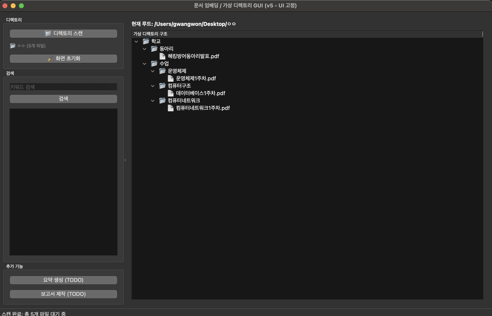

# 1. 싹싹파일(SSAG_FILES)
- 일반 사용자들의 로컬 디렉터리에 흩어진 파일들을 자동으로 분류하고 가상 디렉터리 형태
로 재구성하여 관리 효율과 가시성을 극대화합니다. 또한, 이렇게 정돈된 문서들을 기반
으로 맥락적 정보 검색, 관련 문서 연결, 그리고 새로운 지식 문서 작성을 지원하는 지능
형 파일 관리 및 지식 큐레이션 서비스입니다.
<br>

- 파일 분석 후 실행화면
    - 카테고리별로 분류



# 2.실행방법

1. 프로젝트 폴더로 이동 (현재 스크립트들이 있는 폴더)
```
cd /path/to/your/project
```

2. 가상 환경 생성 (venv는 가상 환경 이름입니다)
```
python -m venv venv
```

3. 가상 환경 활성화
- macOS/Linux
```
source venv/bin/activate
```

- Windows (Command Prompt)
```
venv\Scripts\activate
```

- Windows (PowerShell)
```
.\venv\Scripts\Activate.ps1
```

4. 라이브러리 설치
```
pip install -r requirements.txt
```

6. qdrant 시ㄹ행
- 도커 실행 후 
```
docker run -p 6333:6333 -p 6334:6334 qdrant/qdrant
```

5. 실행
```
python app.py
```
<br>

# 3.프로그램 사용법

1. 폴더스캔
- 자신이 정돈하고자하는 폴더 선택
<br>

2. 화면 초기화
- 다시 실행 원할경우 : 다른 폴더 스캔 등
<br>

3. 검색
- 키워드 위주 파일 검색
<br>

4. 요약 생성
- 파일 AI 요약본 보기
<br>

5. 보고서 제작
- 보고서 제작 기능
